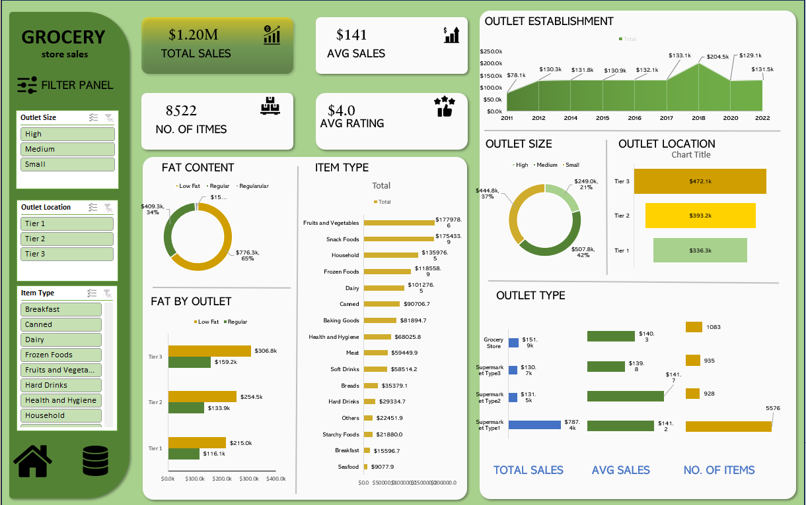

## Grocery Sales Excel Dashboard

### Project Overview
This project showcases an interactive Excel dashboard created using
online grocery sales data to analyze sales performance and outlet insights.

### Key Features
- Pivot Tables & Charts
- Slicers and Filters
- KPI Metrics (Total Sales, Average Rating, Item Count)
- Clean dashboard layout

### Tools & Skills Used
- Microsoft Excel
- Data Cleaning
- Pivot Tables
- Dashboard Design

### Dashboard Preview

